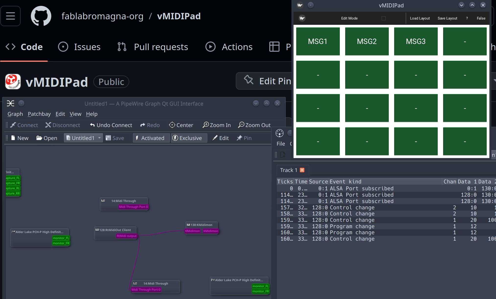

# vMidiPad

### A Python (Kivy) application for sending arbitrary MIDI messages.

ivan.tarozzi@fablabromagna.org

> This software is in really early stage. Stay tuned for update and enanchements

---------

You can arrange buttons on a grid and assign them the MIDI message to send.

The midi port uses mido and rtmidi as backend, so you can see the virtual MIDI output port on your system and route it to the application you desire (eg. using pipewire or jack patch applications).

Tested on GNU/Linux (manjaro) with pipewire: [see the video](./docs/demo1.mp4)

You can use some MIDI monitor tool (eg Drumstick MIDI Monitor) to check the output of this application.

## Python modules Dependencies:

- kivy 
- kivymd
- mido 
- python-rtmidi

## Notes:

### Wrong multiple touch events
In order to fix wrong touch events using touchpad or touchscreen I had to comment out `%(name)s = probesysfs` in the [input] section of my ~/.kivy/config.ini file.
